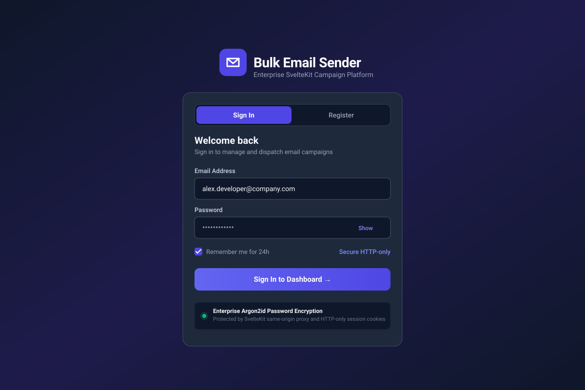
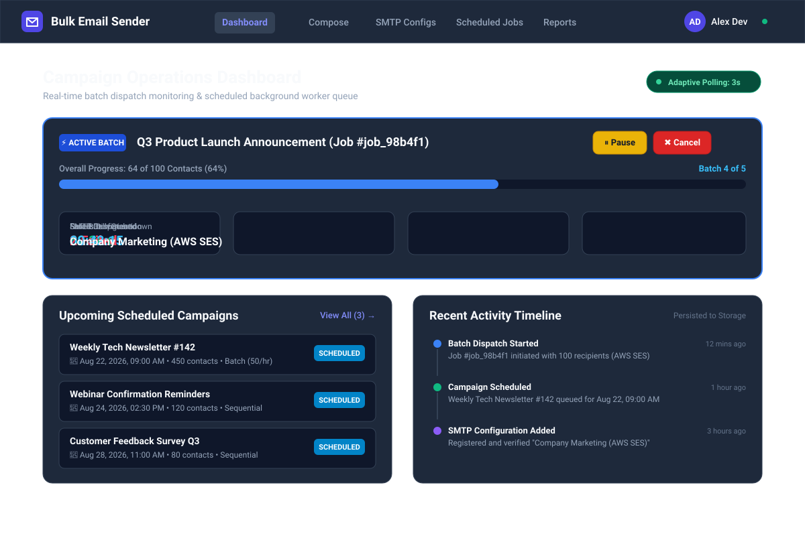
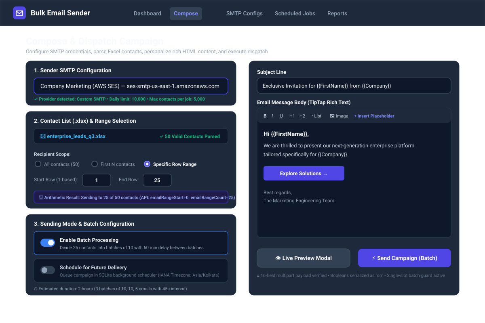
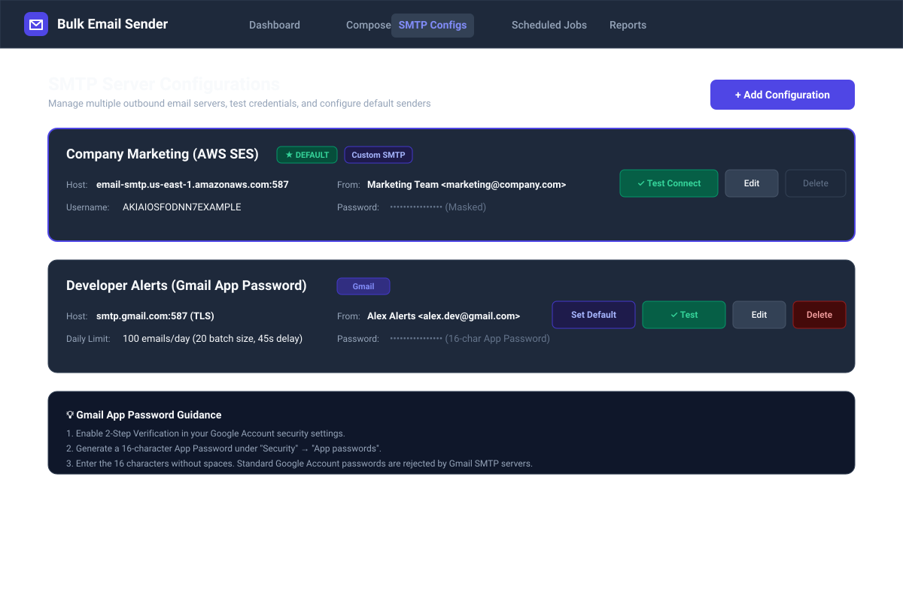
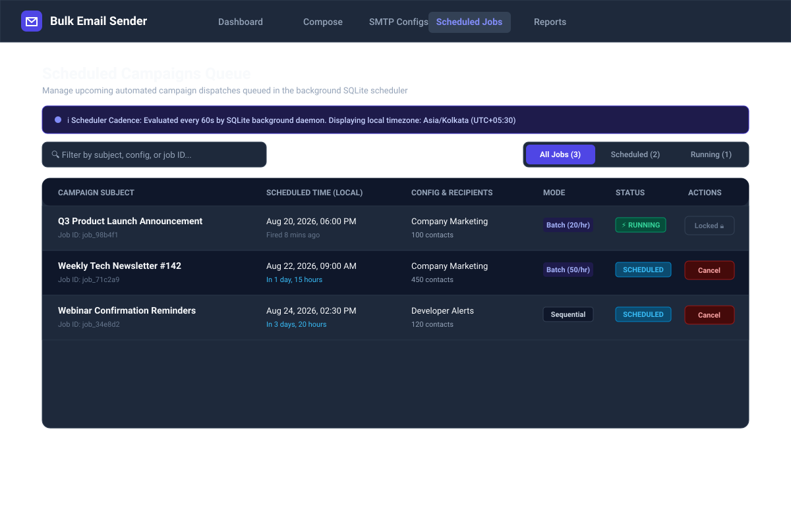
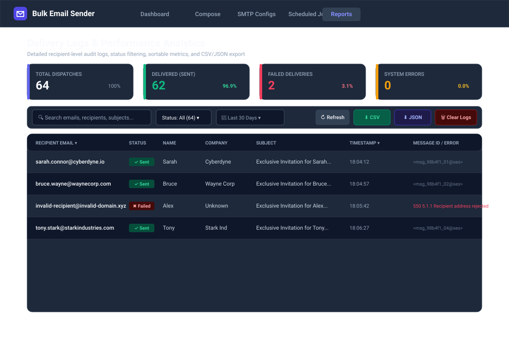
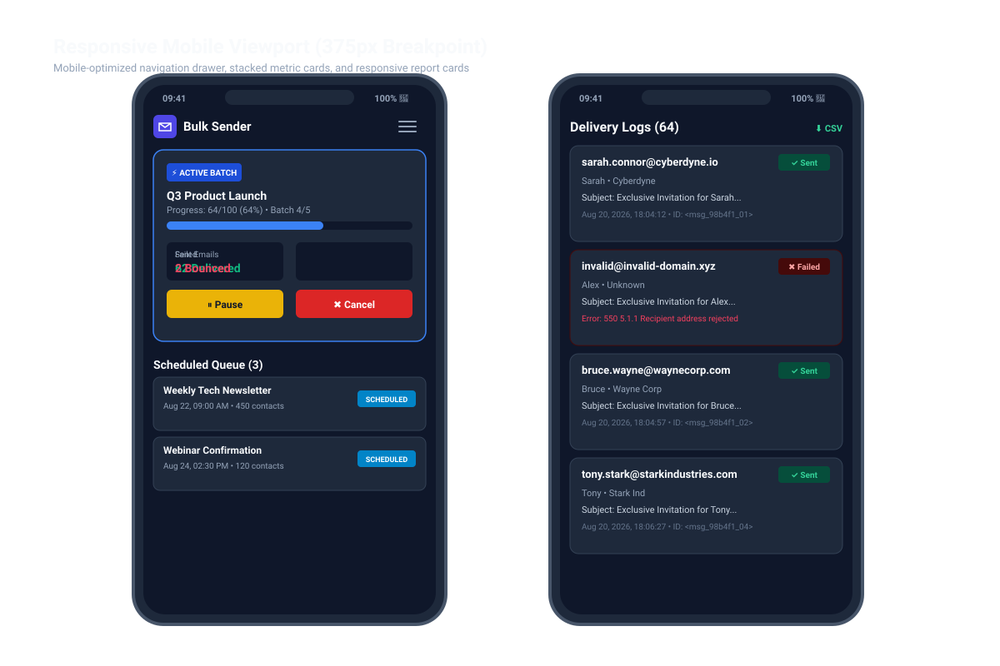
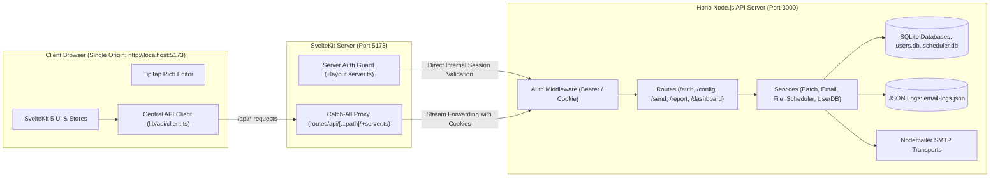

# 🚀 Bulk Email Sender — Enterprise SvelteKit Migration

[](https://kit.svelte.dev/)
[](https://svelte.dev/)
[](https://www.typescriptlang.org/)
[](https://tailwindcss.com/)
[](https://hono.dev/)
[](https://nodejs.org/)
[](https://github.com/WiseLibs/better-sqlite3)
[](https://nodemailer.com/)

---

## 📋 Executive Summary

**Bulk Email Sender** is a production-grade web application designed for high-throughput, personalized email campaign delivery, background job scheduling, and comprehensive recipient audit analytics.

This project delivers a complete architectural migration from a legacy vanilla JavaScript / Bootstrap 5 frontend to a modern **SvelteKit (Svelte 5 + TypeScript + Tailwind CSS v4)** application, powered by a high-performance **Hono** backend running on **Node.js 20+** with **SQLite (`better-sqlite3`)**.

All backend business logic, database schemas, cryptographic operations, and sending algorithms have been strictly preserved per the assignment specifications (`task1.md`), while the user experience, accessibility, responsive design, and developer tooling have been elevated to enterprise production standards.

---

## 📸 Visual Workspace Overview

| Workspace | Description | Preview |
| :--- | :--- | :--- |
| **Authentication** | Secure user login & registration featuring Argon2id hashing, HTTP-only session cookies, and declarative layout guards. |  |
| **Operations Dashboard** | Real-time batch progress monitoring, next-batch countdowns, pause/resume/cancel controls, and persisted activity timelines. |  |
| **Campaign Composer** | Excel parsing (`POST /parse-excel`), 1-based recipient range arithmetic, TipTap rich-text editing, template overrides, and live previews. |  |
| **SMTP Configurations** | Multi-server SMTP management, connection testing (`POST /config/smtp/test`), default sender toggling, and Gmail App Password guidance. |  |
| **Scheduled Jobs Queue** | Localized IANA timezone campaign queue, 60s background scheduler evaluation, and cancellation protection. |  |
| **Reports & Analytics** | Headline delivery metrics, debounced search, status/date filtering, 8-column sortable table, and CSV/JSON exports. |  |
| **Mobile Responsiveness** | Verified mobile layout at 375px breakpoint with collapsible navigation drawer and stacked cards. |  |

---

## 🏛️ Architectural & Framework Justification

Per `task1.md` and `PROJECT_ASSIGNMENT.md`, **SvelteKit 2 (with Svelte 5 runes)** was selected and configured as the frontend architecture. The rationale for this choice rests on several distinct engineering advantages:

### 1. 1:1 Mapping of Operational Workspaces to File-Based Routes
The legacy application was a monolithic 2500+ line script (`public/js/app.js`) manipulating `.d-none` CSS classes on a single HTML document. SvelteKit's file-based routing cleanly separates the application into dedicated, bookmarkable, and shareable workspaces:
- `/dashboard` — Live operations and background worker telemetry.
- `/send` — Campaign composition, contact parsing, and dispatch configuration.
- `/configs` — Outbound SMTP server credentials and testing.
- `/scheduled` — Automated background queue management.
- `/reports` — Audit logs, performance analytics, and data exports.

### 2. Declarative Authentication & Server Layout Guards
Using SvelteKit's layout groups, the authentication boundary is enforced entirely on the server before client JavaScript executes:
- `(auth)` group (`/login`, `/register`): Guarded by `(auth)/+layout.server.ts` — redirects already-authenticated users to `/dashboard`.
- `(app)` group: Guarded by `(app)/+layout.server.ts` — validates session cookies via `lib/server/session.ts` and redirects unauthenticated visitors to `/login?redirectTo=...`.

### 3. Reactive Lifecycle-Scoped Stores vs Leaked Interval Globals
The legacy frontend relied on global `setInterval` timers that leaked memory across view toggles. SvelteKit's lightweight reactive stores (`lib/stores/polling.ts`, `lib/stores/auth.ts`, `lib/stores/activity.ts`, `lib/stores/toast.ts`) encapsulate polling logic with strict lifecycle teardown (`onDestroy`), ensuring **zero unnecessary network traffic when idle**.

### 4. Compile-Time Reactivity and Minimal Runtime Footprint
Unlike heavy virtual-DOM frameworks, Svelte 5 compiles components down to surgical, vanilla DOM updates. This ensures maximum client-side performance during frequent 3-second dashboard polling cycles and smooth rich-text editing in TipTap.

### 5. Acknowledged Trade-Offs
While React or Next.js offer broader third-party component ecosystems, SvelteKit provides a significantly smaller bundle size, superior performance for data-intensive dashboards, and modern web standards compliance. All required components (TipTap editor, Lucide icons, accessible dialogs) integrate natively without framework overhead.

---

## 🏗️ System Architecture & Topology

The application operates as two decoupled, independently-run packages wired together via a **Same-Origin Backend Proxy (ADR 0001)**:



### Why the Same-Origin `/api` Proxy is Load-Bearing (ADR 0001)
The backend's `cors()` middleware defaults to wildcard `*` without credentials, and its session cookie is issued with `sameSite: "Lax"`. Per `task1.md`, editing backend authentication code is strictly forbidden. Direct cross-origin `fetch()` with credentials would fail in modern browsers. 

The SvelteKit server-side proxy (`routes/api/[...path]/+server.ts`) solves this by:
1. Receiving client requests on the same origin (`http://localhost:5173/api/...`).
2. Forwarding the stream, headers, and cookies to `BACKEND_ORIGIN` (`http://localhost:3000/...`).
3. Relaying `Set-Cookie` and response headers back to the browser verbatim.

### What Changed in the Backend Summary
In compliance with `task1.md` and `PROJECT_ASSIGNMENT.md` §2:
- ✅ **Runtime Migration**: Swapped `hono/bun` with `@hono/node-server` and `better-sqlite3`.
- ✅ **Static Serving Removal**: Deleted legacy `public/` folder, `src/routes/index.ts`, and `serveStatic` middleware.
- ✅ **JSON 404 Handler**: Configured `notFound` in `src/app.ts` to return standard JSON 404 responses.
- 🔒 **Zero Schema / Logic Changes**: Table schemas, password hashing (Argon2id), route paths, 16-field multipart send payloads, batching logic, and SQLite queries remain 100% frozen.

---

## 📁 Repository Directory Layout

```
bulk-email-sender/
├── .github/
│   ├── workflows/pr-checks.yml  # GitHub Actions CI workflow (Backend + Frontend)
│   └── labeler.yml              # PR label automation
├── data/                         # SQLite databases (data/users.db, data/scheduler.db - auto-created)
├── docs/
│   ├── adr/
│   │   └── 0001-frontend-backend-topology.md  # Architectural Decision Record
│   ├── api-contract.md          # Frozen backend API contract (all 28 routes)
│   └── screenshots/             # Visual documentation SVG assets
├── logs/                         # Application logs (logs/email-logs.json - auto-created)
├── src/                          # Backend Source Code (Hono on Node.js)
│   ├── app.ts                   # Hono application entrypoint & route mounts
│   ├── types.ts                 # Backend TypeScript interfaces
│   ├── middleware/
│   │   └── auth.ts              # Session cookie & Bearer token middleware
│   ├── routes/
│   │   ├── auth.ts              # /auth/login, /register, /logout, /me
│   │   ├── config.ts            # /config/smtp CRUD, test, default endpoints
│   │   ├── dashboard.ts         # /dashboard/poll-status and /dashboard/data
│   │   ├── report.ts            # /report, /report/export/*, /report/clear
│   │   └── send.ts              # /send, /parse-excel, /provider-info, /batch-*, /scheduled-jobs
│   └── services/
│       ├── batchService.ts      # Single-slot in-memory batch processor
│       ├── emailService.ts      # Nodemailer transport & email dispatch engine
│       ├── fileService.ts       # Excel parsing & placeholder replacement
│       ├── logService.ts        # JSON logging & stats aggregator
│       ├── notificationService.ts # Completion notifications & test alerts
│       ├── providerLimits.ts    # SMTP provider detection & rate caps
│       ├── schedulerService.ts  # SQLite background scheduler daemon (60s tick)
│       └── userDatabase.ts      # SQLite user accounts, sessions & SMTP configs
├── frontend/                     # SvelteKit Frontend Application
│   ├── src/
│   │   ├── routes/
│   │   │   ├── (auth)/          # Unauthenticated routes (/login, /register)
│   │   │   ├── (app)/           # Protected workspaces (/dashboard, /send, /configs, /scheduled, /reports)
│   │   │   └── api/[...path]/   # Same-origin backend streaming proxy
│   │   └── lib/
│   │       ├── api/             # Typed API client modules (client, auth, config, email, dashboard, scheduled, report)
│   │       ├── components/
│   │       │   ├── ui/          # 16 Reusable UI primitives (Button, Modal, Table, Toast, Input, etc.)
│   │       │   ├── shared/      # App shell chrome (Navbar, Sidebar, PageHeader, UserMenu, Footer)
│   │       │   ├── config/      # SMTP management components
│   │       │   ├── email/       # Campaign composer & range selector components
│   │       │   ├── dashboard/   # BatchMonitor, ScheduledPreview, ActivityTimeline
│   │       │   ├── scheduled/   # ScheduledJobTable, ScheduledJobCard
│   │       │   └── reports/     # ReportStatsCards, ReportToolbar, ReportTable, ReportCard
│   │       ├── stores/          # Svelte stores (auth, toast, activity, polling)
│   │       ├── types/           # Frontend TypeScript interfaces & forms
│   │       └── utils/           # Pure helpers (placeholders, range math, sendForm, formatters)
│   ├── static/
│   │   └── samples/
│   │       └── sample-contacts.xlsx  # Rescued sample contact workbook
│   ├── package.json             # Frontend dependencies & scripts
│   ├── svelte.config.js         # SvelteKit configuration
│   └── vite.config.ts           # Vite + Tailwind CSS v4 configuration
├── package.json                 # Backend dependencies & scripts
├── tsconfig.json                # Backend TypeScript configuration
├── CONTRIBUTING.md              # Contributor guide
└── README.md                    # Project documentation (this file)
```

---

## ⚡ Quick Start & Setup Instructions

### Prerequisites
- **Node.js**: >= 20.0.0 (Node 20 LTS or Node 22)
- **npm**: >= 10.0.0
- **SMTP Credentials** (Optional for testing, required for live sending; Gmail requires an [App Password](https://myaccount.google.com/apppasswords) with 2FA enabled).

---

### Step 1: Backend Setup (Port 3000)

```bash
# 1. Install backend dependencies
npm install

# 2. Configure environment variables
cp .env.example .env

# 3. Start the backend development server
npm run dev
```

The backend starts at `http://localhost:3000`. Runtime databases (`data/users.db`, `data/scheduler.db`), logs (`logs/email-logs.json`), and upload directories (`uploads/`) will be initialized automatically.

---

### Step 2: Frontend Setup (Port 5173)

In a separate terminal:

```bash
# 1. Navigate to the frontend directory
cd frontend

# 2. Install frontend dependencies
npm install

# 3. Configure frontend environment variables
cp .env.example .env

# 4. Start the SvelteKit development server
npm run dev
```

Open your browser and navigate to **`http://localhost:5173`**.

> [!IMPORTANT]
> **Always access the application through the frontend origin (`http://localhost:5173`)**. Directly navigating to the backend origin bypasses the proxy and breaks session cookie handling.

---

## 🔑 Environment Variables Reference

### Backend Environment Variables (`.env`)

| Variable | Description | Required | Default / Example |
| :--- | :--- | :--- | :--- |
| `PORT` | Port for the backend Node.js / Hono HTTP server. | No | `3000` |
| `SESSION_SECRET` | Secret key used to encrypt session tokens. **Must be set to a fixed string** in production; omitting it generates an ephemeral key, invalidating user sessions on server restarts. | **Yes** | `a_secure_random_32_character_string` |
| `SMTP_HOST` | Fallback system SMTP server host. | No | `smtp.gmail.com` |
| `SMTP_PORT` | Fallback system SMTP server port. | No | `587` |
| `SMTP_SECURE` | Fallback SMTP SSL/TLS flag (`true` or `false`). | No | `false` |
| `SMTP_USER` | Fallback system SMTP username / email. | No | `you@example.com` |
| `SMTP_PASS` | Fallback system SMTP password / app password. | No | `your_app_password` |
| `FROM_EMAIL` | Fallback default sender email address. | No | `you@example.com` |
| `FROM_NAME` | Fallback default sender display name. | No | `Bulk Email Sender` |
| `NOTIFICATION_SMTP_HOST` | Optional SMTP server for automated completion alerts. | No | `smtp.gmail.com` |
| `NOTIFICATION_SMTP_PORT` | Optional SMTP port for completion alerts. | No | `587` |
| `NOTIFICATION_SMTP_SECURE`| Optional SMTP SSL/TLS flag for completion alerts. | No | `false` |
| `NOTIFICATION_SMTP_USER` | Optional SMTP user for completion alerts. | No | `notify@example.com` |
| `NOTIFICATION_SMTP_PASS` | Optional SMTP password for completion alerts. | No | `notify_password` |
| `NOTIFICATION_FROM_NAME` | Display name for completion alert emails. | No | `Campaign Notifier` |

### Frontend Environment Variables (`frontend/.env`)

| Variable | Description | Required | Value |
| :--- | :--- | :--- | :--- |
| `PUBLIC_API_BASE_URL` | Public API base URL exposed to the browser. | Yes | `/api` |
| `BACKEND_ORIGIN` | Private server-side backend origin used by the SvelteKit proxy and session load guard. Never exposed to the browser. | Yes | `http://localhost:3000` |

---

## 🎯 First-Run Demo Walkthrough

Follow this step-by-step walkthrough to test the complete end-to-end system:

1. **Register a User Account**:
   - Navigate to `http://localhost:5173/register`.
   - Create an account (e.g., `Alex Dev`, `alex@company.com`, password: `Password123!`).
   - You will be automatically authenticated and redirected to the **Dashboard** (`/dashboard`).

2. **Configure an SMTP Server**:
   - Navigate to **SMTP Configs** (`/configs`).
   - Click **"+ Add Configuration"**.
   - Enter your SMTP details (e.g., Gmail App Password or custom SMTP).
   - Click **"Test Connection"** to verify connectivity with the remote server.
   - Click **"Save Configuration"** and toggle **"Set as Default"**.

3. **Compose & Personalize a Campaign**:
   - Navigate to **Compose** (`/send`).
   - Select your saved SMTP configuration.
   - Click **"Download Sample Contacts"** to obtain `sample-contacts.xlsx`.
   - Upload the sample file. The backend parser (`POST /parse-excel`) parses valid emails and displays contact previews.
   - Choose a recipient range (e.g., "Specific Row Range" rows 1–5).
   - Enter a Subject with placeholders: `Exclusive Invitation for {{FirstName}} from {{Company}}`.
   - Use the **TipTap WYSIWYG editor** to compose a personalized message using placeholders (`{{FirstName}}`, `{{Email}}`, `{{Company}}`).
   - Click **"👁️ Live Preview"** to inspect the real-time rendered email for contact #1.

4. **Execute Campaign Dispatch**:
   - **Mode A (Immediate)**: Click **"🚀 Send Campaign Immediately"**.
   - **Mode B (Batch Mode)**: Toggle **"Enable Batch Processing"**, set Batch Size: 2, Batch Delay: 1 min, Email Delay: 5s, and click **"⚡ Send Campaign (Batch)"**.
   - **Mode C (Scheduled)**: Toggle **"Schedule for Future Delivery"**, pick a future time, enter a notification email, test alerts with **"📨 Test Alert"**, and click **"📅 Schedule Campaign"**.

5. **Monitor & Audit Deliveries**:
   - Open the **Dashboard** (`/dashboard`) to view live batch progress, countdown timers, and control buttons (Pause / Resume / Cancel).
   - Open **Scheduled Jobs** (`/scheduled`) to inspect upcoming queued campaigns.
   - Open **Reports** (`/reports`) to inspect delivery logs, search/filter by status, and download **CSV** or **JSON** audit logs.

---

## 📡 Complete API Reference & Route Reconciliation

The backend exposes **28 distinct endpoints** across 6 feature modules. All endpoints require session authentication except the public authentication routes.

### 1. Authentication & Session (`src/routes/auth.ts`, `src/app.ts`)

| Method | Path | Request Body | Response Shape | Auth Required |
| :--- | :--- | :--- | :--- | :--- |
| `POST` | `/auth/register` | JSON `{ name, email, password }` | `{ success: true, message, user: { id, email, name } }` | No (Public) |
| `POST` | `/auth/login` | JSON `{ email, password }` | `{ success: true, message, user: { id, email, name } }` | No (Public) |
| `POST` | `/auth/logout` | None | `{ success: true, message }` | Yes (Clears cookie) |
| `GET` | `/auth/me` | None | `{ success: true, user: { id, email, name } }` | Yes (401 if unauthenticated) |
| `GET` | `/user/info` | None | `{ success: true, user: { id, email, name } }` | Yes (Legacy duplicate) |
| `GET` | `/health` | None | `{ status: "OK", timestamp, version }` | **Yes** (Requires session) |

### 2. SMTP Configurations (`src/routes/config.ts`)

| Method | Path | Request Body | Response Shape | Notes |
| :--- | :--- | :--- | :--- | :--- |
| `GET` | `/config/smtp` | None | `{ success: true, data, hasConfig, hasEnvConfig, currentMode, userConfigs[], userId, userName }` | Returns user's configs default-first. |
| `POST` | `/config/smtp` | JSON `{ name, host, port, secure, user, pass, fromEmail, fromName, isDefault }` | `{ success: true, message, configId }` | Validates host/user/pass/email. |
| `PUT` | `/config/smtp/:configId` | Partial JSON (same keys) | `{ success: true, message }` | Omit `pass` to preserve existing password. |
| `DELETE` | `/config/smtp/:configId`| None | `{ success: true, message }` | 404 if not found. |
| `POST` | `/config/smtp/:configId/default` | None | `{ success: true, message }` | Sets configuration as user default. |
| `GET` | `/config/smtp/active` | None | `{ success: true, data, mode, configId?, configName? }` | Resolves active default sender. |
| `POST` | `/config/smtp/test` | JSON `{ host, port, secure, user, pass }` | `{ success: true, message }` | Validates connection before saving. |

### 3. Campaign Dispatch & File Parsing (`src/routes/send.ts`)

| Method | Path | Request Body | Response Shape | Notes |
| :--- | :--- | :--- | :--- | :--- |
| `POST` | `/parse-excel` | Multipart `excelFile: File` | `{ success: true, contacts: Contact[], totalCount: number }` | Returns first 5 preview contacts + total. |
| `POST` | `/provider-info` | Multipart `smtpHost`, `hasNotification` (`"true"`/`"false"`) | `{ success: true, data: { provider, dailyLimit, maxContacts, recommendedBatchSize, recommendedDelay } }` | Rate limit warnings. |
| `POST` | `/send` | Multipart (16 fields: `configId`, `subject`, `htmlContent`, `delay`, `useBatch`, `batchSize`, `batchDelay`, `emailDelay`, `scheduleEmail`, `scheduledTime`, `notifyEmail`, `notifyBrowser`, `emailRangeStart`, `emailRangeCount`, `excelFile`, `htmlTemplate`) | `{ success: true, message, contactCount, jobId?, scheduledMode?, batchMode?, configUsed }` | Core 16-field dispatch contract. Booleans must be `"on"`. |
| `POST` | `/test-notification` | JSON `{ testEmail }` | `{ success: true, message }` | Verifies alert delivery. |

### 4. Batch & Scheduled Job Controls (`src/routes/send.ts`)

| Method | Path | Request Body | Response Shape | Notes |
| :--- | :--- | :--- | :--- | :--- |
| `GET` | `/batch-status` | None | `{ success: true, data: { isRunning, currentJob, totalJobs, completedJobs } }` | Single-slot batch monitor data. |
| `POST` | `/batch-pause` | None | `{ success: true, message }` | Pauses active batch execution. |
| `POST` | `/batch-resume` | None | `{ success: true, message }` | Resumes paused batch execution. |
| `DELETE`| `/batch-cancel` | None | `{ success: true, message }` | Cancels batch (method is `DELETE`). |
| `GET` | `/scheduled-jobs` | None | `{ success: true, data: ScheduledJob[] }` | Returns `scheduled` and `running` jobs. |
| `DELETE`| `/scheduled-jobs/:id` | None | `{ success: true, message }` | Cancels queued job (disabled on `running`). |

### 5. Operations Dashboard (`src/routes/dashboard.ts`)

| Method | Path | Request Body | Response Shape | Notes |
| :--- | :--- | :--- | :--- | :--- |
| `GET` | `/dashboard/poll-status` | None | `{ success: true, data: { pollNeeded, pollInterval, hasActiveBatch, hasScheduledJobs, hasRunningScheduledJobs } }` | Adaptive cadence: 3s/10s/30s/idle. |
| `GET` | `/dashboard/data` | None | `{ success: true, data: { batch, scheduledJobs, timestamp } }` | Returns cached active batch & top 5 queue. |

### 6. Reports & Audit Analytics (`src/routes/report.ts`)

| Method | Path | Request Body | Response Shape | Notes |
| :--- | :--- | :--- | :--- | :--- |
| `GET` | `/report` | None | `{ success: true, data: { logs: EmailLog[], stats: { total, sent, failed, errors } } }` | Full delivery audit log and stats. |
| `GET` | `/report/export/csv` | None | `text/csv` attachment (`email-logs.csv`) | 9-column CSV download. |
| `GET` | `/report/export/json`| None | `application/json` attachment (`email-logs.json`) | JSON array download. |
| `DELETE`| `/report/clear` | None | `{ success: true, message }` | Irreversible log truncation. |

---

### 🔍 Endpoint Reconciliation: Brief vs Real Code

`PROJECT_ASSIGNMENT.md` contained several example endpoints that differed from the actual backend implementation. The table below documents the reconciliation:

| `PROJECT_ASSIGNMENT.md` Example | Implemented Backend Endpoint | Reason & Real Code Location |
| :--- | :--- | :--- |
| `POST /config/smtp/:id/test` | `POST /config/smtp/test` | No `:id` in URL; full config object is tested in JSON body (`src/routes/config.ts:289`). |
| `POST /config/smtp/:id/set-default` | `POST /config/smtp/:configId/default` | Route parameter named `:configId` (`src/routes/config.ts:225`). |
| `POST /send/preview` | **Client-side only** | No backend preview endpoint exists. Preview is generated client-side with `replacePlaceholders()`. |
| `GET /send/status` | `GET /batch-status` | Batch status endpoint is `/batch-status` (`src/routes/send.ts:569`). |
| `POST /send/pause` / `POST /send/resume` | `POST /batch-pause` / `POST /batch-resume` | Batch controls use `/batch-*` paths (`src/routes/send.ts:574`). |
| `POST /send/cancel` | `DELETE /batch-cancel` | Method is **`DELETE`**, not `POST` (`src/routes/send.ts:584`). |
| `GET /dashboard/stats` | `GET /report` | Metrics are provided by `/report` (`src/routes/report.ts:7`). |
| `GET /schedule/jobs` | `GET /scheduled-jobs` | Queue listing endpoint is `/scheduled-jobs` (`src/routes/send.ts:519`). |
| `DELETE /schedule/jobs/:id` | `DELETE /scheduled-jobs/:id` | Queue cancellation endpoint is `/scheduled-jobs/:id` (`src/routes/send.ts:524`). |

---

## 🌟 Improvements Over the Original Frontend

The migrated SvelteKit frontend is an engineering and UX overhaul of the legacy application:

1. **Real Routing vs Monolithic Tab Toggling**:
   - *Legacy*: Toggled `.d-none` on three divs inside a single 1300-line HTML file. No URL state, no browser back/forward support, and no bookmarking.
   - *SvelteKit*: File-based routing with dedicated URLs (`/dashboard`, `/send`, `/configs`, `/scheduled`, `/reports`, `/login`, `/register`), deep-link redirects, and proper browser history.

2. **Decoupled SMTP Configuration Management**:
   - *Legacy*: SMTP configuration was a cluttered card crammed above the campaign composer.
   - *SvelteKit*: Dedicated `/configs` workspace featuring full CRUD, connection testing modals, default badges, and Gmail App Password guidance.

3. **Advanced Reports & Analytics Workspace**:
   - *Legacy*: Static, non-filterable table.
   - *SvelteKit*: Client-side debounced search, status filtering (`Sent`, `Failed`, `Error`), date range filtering, sortable table columns, and direct CSV/JSON blob downloads.

4. **Accessible, Reusable Modal System**:
   - *Legacy*: Four separate Bootstrap modals without keyboard focus trapping or proper ARIA attributes.
   - *SvelteKit*: Accessible `Modal.svelte` and `ConfirmDialog.svelte` primitives with automated focus trapping, `Escape` key dismissal, and focus restoration.

5. **Adaptive Lifecycle Polling Engine**:
   - *Legacy*: Unbounded global `setInterval` timers that leaked across view changes.
   - *SvelteKit*: `lib/stores/polling.ts` adapts polling cadence based on backend `pollInterval` (3s active batch / 10s running / 30s pending / 0s idle) with guaranteed `onDestroy` cleanup.

6. **Centralized Typed API Client**:
   - *Legacy*: 24 scattered raw `fetch()` calls with inconsistent error handling and hardcoded paths.
   - *SvelteKit*: Single `lib/api/client.ts` wrapper with central 401 handling, automatic cookie inclusion, and strictly typed request/response envelopes.

7. **Timezone-Aware Scheduling & Precise Range Math**:
   - *Legacy*: Unchecked datetime values caused timezone skew; range selections suffered from 0-based/1-based confusion.
   - *SvelteKit*: Detects user IANA timezone, converts local datetime to UTC ISO string before submission, and validates 1-based user rows to 0-based API parameters.

---

## ⚠️ Known Backend Limitations (Preserved Deliberately)

Per `task1.md` ("Do not modify backend logic or database structure"), the following backend behaviors have been **documented and handled cleanly in the UI rather than altered**:

1. **Global Report & Queue Visibility**: `GET /report`, `GET /scheduled-jobs`, and batch control endpoints are not filtered by `userId`. All authenticated users see the global job queue and delivery logs.
2. **Plaintext Password in Active Config**: `GET /config/smtp` returns the active SMTP password in its `data` property. The frontend masks this value in `ConfigDetails.svelte` and never renders raw credentials.
3. **Single-Slot In-Memory Batch Service**: `batchService.ts` executes one batch job at a time in memory. State is lost on server restart, and details clear 30 seconds after completion.
4. **60-Second Background Scheduler Cadence**: `schedulerService.ts` evaluates due jobs on a 60-second `setInterval` tick. Campaigns may fire up to 60 seconds after their scheduled timestamp.
5. **Authenticated `/health` Check**: `GET /health` requires an active user session and returns 401 to unauthenticated probes.
6. **JSON File Logging**: Email logs are persisted to `logs/email-logs.json` rather than SQLite.

---

## 🚢 Deployment Guide

### Option 1: Frontend on Vercel / Cloudflare Pages / Node
- **Adapter**: Uses `@sveltejs/adapter-node` (or `@sveltejs/adapter-vercel`).
- **Configuration**: Set `BACKEND_ORIGIN` to the production backend URL (e.g., `https://api.yourdomain.com`) and `PUBLIC_API_BASE_URL` to `/api`.
- **Build Command**: `npm run build`
- **Output Directory**: `build`

### Option 2: Backend on Render / Railway / Fly.io / VPS
- **Runtime**: Node.js 20+
- **Persistent Volume**: **CRITICAL** — Mount a persistent disk covering `./data`, `./logs`, and `./uploads`. Without persistent storage, SQLite databases and JSON logs will be wiped on container restarts.
- **Health Check**: Configure health checks using a **TCP port check** on port 3000 (do not use `GET /health` as it requires authentication).
- **Environment Variables**: Configure all `.env` variables, ensuring `SESSION_SECRET` is set to a permanent string.

---

## 📜 NPM Scripts Reference

### Backend Scripts (Repository Root)

| Command | Action | Description |
| :--- | :--- | :--- |
| `npm run dev` | `tsx watch src/app.ts` | Starts backend development server on port 3000 with hot-reload. |
| `npm start` | `tsx src/app.ts` | Starts backend production server. |
| `npm run build` | `tsc --noEmit` | Validates TypeScript types across all backend source files. |
| `npm run typecheck` | `tsc --noEmit` | Static TypeScript typecheck. |
| `npm run reset-db` | `rm -f data/users.db data/scheduler.db` | Deletes SQLite databases to restore clean initial state. |
| `npm run clean` | `rm -rf dist uploads/* logs/* data/users.db` | Cleans temporary logs, uploads, and runtime caches. |
| `npm test` | Stub runner | Verifies backend readiness and points to validation protocols. |

### Frontend Scripts (`./frontend/`)

| Command | Action | Description |
| :--- | :--- | :--- |
| `npm run dev` | `vite dev` | Starts SvelteKit development server on port 5173. |
| `npm run check` | `svelte-kit sync && svelte-check` | Comprehensive Svelte & TypeScript typecheck (0 errors). |
| `npm run lint` | `eslint .` | Runs ESLint across all `.svelte` and `.ts` files (0 warnings). |
| `npm run format` | `prettier --write .` | Formats all frontend codebase files with Prettier. |
| `npm run build` | `vite build` | Compiles production server build using `@sveltejs/adapter-node`. |
| `npm run preview` | `vite preview` | Previews the compiled production build locally. |

---

## 🛠️ Development & Tooling Notes

- **Architecture & Contract Reconciliation**: Authored with manual inspection of all 28 Hono routes, SQLite schemas, Nodemailer transports, and Svelte 5 component boundaries.
- **Accessibility & Polish**: Form controls feature explicit `<label for="...">` associations, `aria-describedby` error bindings, `aria-current="page"` navigation markers, and keyboard-operable modals.
- **Bonus Scope Notice**: In accordance with `task1.md`, **no unrequested backend routes or unsupported features were added**, ensuring strict compliance with frozen backend constraints.

---

## ⚖️ License & Credits

This project was developed as part of the Full Stack Developer migration assignment.
- **Backend Architecture**: Hono, Node.js, SQLite, Nodemailer.
- **Frontend Architecture**: SvelteKit, Svelte 5, Tailwind CSS v4, TipTap.
